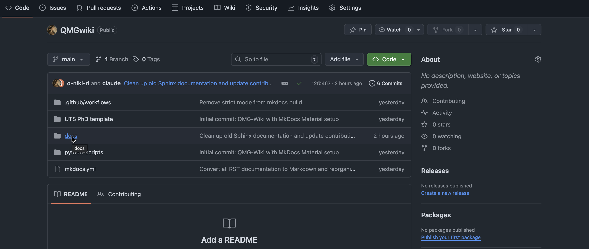
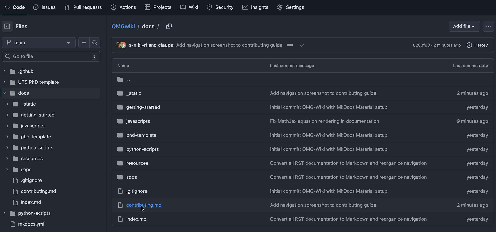
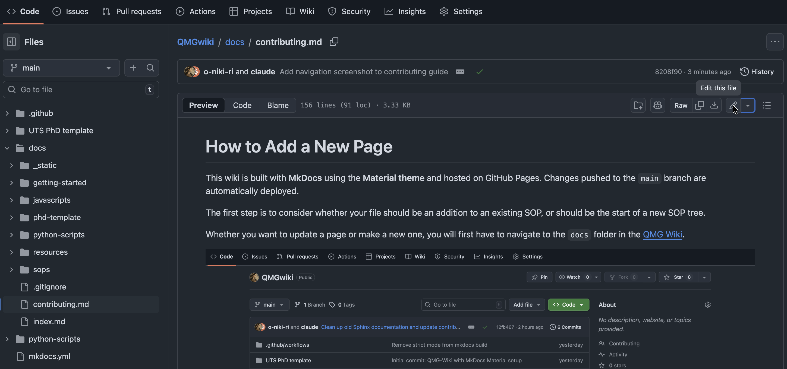
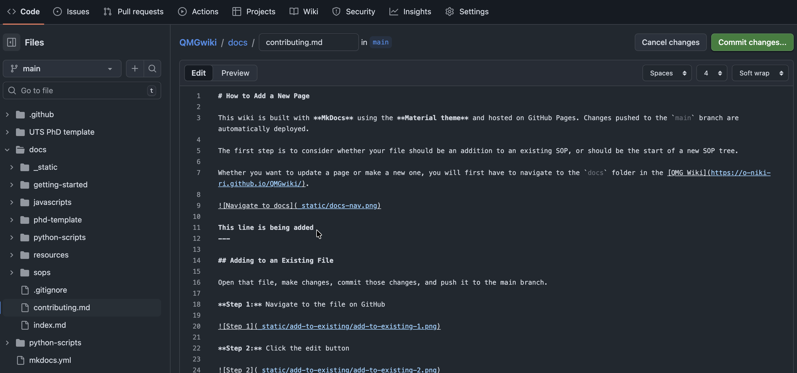
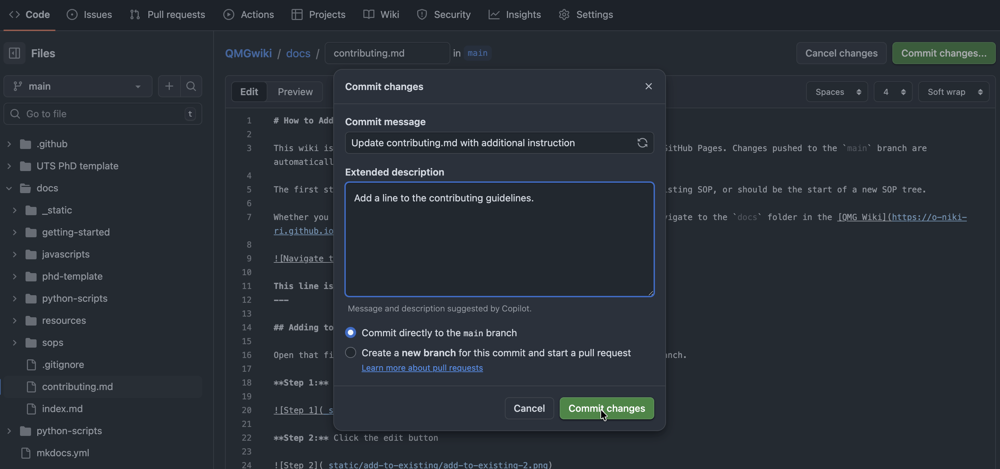
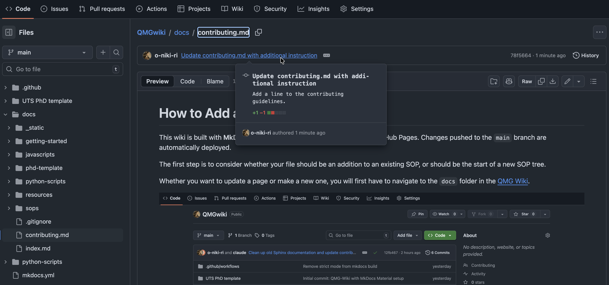

# How to Add a New Page

This wiki is built with **MkDocs** using the **Material theme** and hosted on GitHub Pages. Changes pushed to the `main` branch are automatically deployed.

The first step is to consider whether your file should be an addition to an existing SOP, or should be the start of a new SOP tree.

Whether you want to update a page or make a new one, you will first have to navigate to the `docs` folder in the [QMG Wiki](https://o-niki-ri.github.io/QMGwiki/).




---

## Adding to an Existing File

To update an existing page, you'll edit the file directly on GitHub, then save ("commit") your changes.

**Step 1:** Click on the file you want to edit

In the `docs` folder, find and click on the file you want to modify. Files end in `.md` (Markdown format).



**Step 2:** View the file and click the edit button

You'll see a preview of the file's contents. To make changes, click the **pencil icon** (edit button) in the top-right corner of the file view.



**Step 3:** Make your changes

GitHub will switch to edit mode, showing the raw Markdown text. Make your edits directly in this text editor. You can use the "Preview" tab to see how your changes will look.



**Step 4:** Click "Commit changes"

When you're done editing, click the green **"Commit changes..."** button in the top-right corner.


**Step 5:** Write a commit message and confirm

A dialog will appear asking for a **commit message** - this is a short description of what you changed (e.g., "Fix typo in fabrication steps" or "Add new section on safety"). Make sure **"Commit directly to the main branch"** is selected, then click **"Commit changes"**.



**Step 6:** Verify your changes were saved

After committing, you'll return to the file view. You should see your commit message appear at the top, confirming your changes were saved. The wiki will automatically update within a few minutes.



---

## Creating a New SOP File

Prepare your document offline as much as possible before adding it to the wiki. Once ready, follow these steps:

**Step 1:** Navigate to the docs folder


**Step 2:** Click "Add file"


**Step 3:** Create your new file


**Step 4:** Write your content

{ width="50%" }

**Step 5:** Commit the new file


**Step 6:** Update `mkdocs.yml`

!!! warning "Don't skip this step!"
    If you don't add your page to the `nav:` section in `mkdocs.yml`, it won't appear in the navigation menu.

Open `mkdocs.yml` in the repository root and add your new page to the `nav:` section:

```yaml
nav:
  - Home: index.md
  - SOPs:
      - Fabrication Methods: sops/fabrication.md
      - Your New Page: sops/your-new-page.md  # Add your page here
```

Commit this change as well.

**Step 7:** Verify it appears on the wiki

{ width="70%" }

---

## Markdown Syntax

This wiki uses **Markdown** (`.md` files) instead of reStructuredText.

### Basic Formatting

```markdown
# Heading 1
## Heading 2
### Heading 3

**bold text**
*italic text*

- bullet point
- another point

1. numbered list
2. second item

[Link text](https://example.com)
```

### Adding Images

Images should be stored in `docs/_static/`. Either directly or in a folder for multiple pictures.

```markdown


<!-- With custom width -->
{ width="50%" }
```

### Adding Notes/Warnings

```markdown
!!! note
    This is a note box.

!!! warning
    This is a warning box.

!!! tip
    This is a tip box.
```

---

---

## Local Preview (Optional)

To preview changes locally before pushing:

```bash
pip install mkdocs-material
mkdocs serve
```

Then open `http://127.0.0.1:8000` in your browser.

---

!!! tip
    Always check your changes have rendered the way you expect on the [QMG Wiki](https://o-niki-ri.github.io/QMGwiki/).
